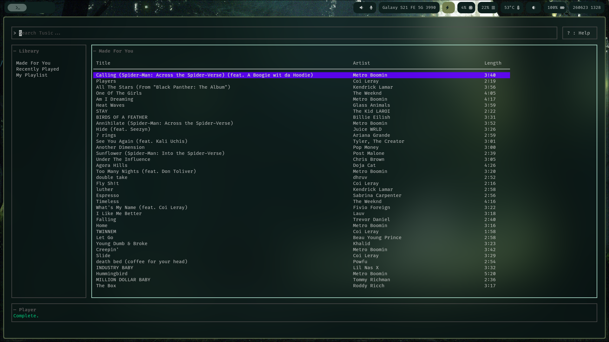

# Tusic

A lightning-fast, Vim-driven Terminal User Interface (TUI) for streaming Music. 

Tusic strips away the bloat of modern electron apps, giving you a clean, keyboard-centric grid layout.



## Features

* **Vim-Native Navigation:** Keep your hands on the home row. Navigate panes, scroll lists, and search entirely via standard Vim keybindings (`h`, `j`, `k`, `l`, `/`).
* **Smart "Made For You":** Analyzes your local listening history, calculates your top artists, and automatically curates a YouTube Music radio mix on startup.
* **Local Database:** Fully private, local SQLite database stores your listening history and custom saved playlists.
* **Gapless MPV Playback:** Audio is handled asynchronously via a hidden `libmpv` background process for zero-latency playback.
* **Bypass Protections:** Uses `yt-dlp` under the hood to reliably extract and resolve high-quality audio streams directly from YouTube's servers.

## Requirements

### System Dependencies
You need the `mpv` media player and 'yt-dlp' installed on your system for the audio engine to work.

## Installation & Setup

1. **Clone the repository:**
   ```bash
   git clone https://github.com/impossibleclone/tusic-go.git
   cd tusic
   ```

2. **Build the program:**
   ```bash
   go mod tidy
   make build
   ```

4. **Run the program:**
   ```bash
   ./tusic
   ```

## ⌨️ Keybindings

| Key | Action | Context |
| :--- | :--- | :--- |
| `h` | Focus Left (Library Pane) | Normal Mode |
| `l` | Focus Right (Songs Table) | Normal Mode |
| `H` | Focus Left (Search Results) | Up Next Table |
| `L` | Focus Right (Up Next Table) | Search Results |
| `j` | Move Cursor Down | Normal Mode |
| `k` | Move Cursor Up | Normal Mode |
| `/` | Focus Search Bar | Normal Mode |
| `Enter` | Play Selected Track / Submit Search | Normal/Search Mode |
| `p` | Play / Pause Audio | Global |
| `s` | Save Song to Local Playlist | Focused on Songs Table |
| `d` | Delete Song from Local Playlist | Focused on Songs Table |
| `r` | Refresh Recommendations | Normal Mode |
| `?` | Toggle Help Menu | Global |
| `Esc` | Unfocus Search / Close Help | Search/Help Mode |
| `q` | Quit Tusic | Global |


## Roadmap / TODO
- [x] Grid Layout
- [x] Local SQLite History & Playlists
- [x] Dynamic "Made For You" Curation
- [x] Timestamps can be seen
- [x] Windows for search results and song recommendations to play next in "Up Next".
- [x] Auto-play functionality (play next song from "Up Next" when current finishes)
- [ ] going back and forward in song timeline.
